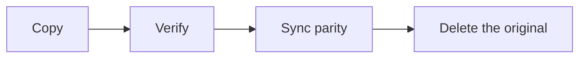

# Writing user docs

Pages on the public site (`site/docs/`, and any `site/versioned_docs/version-X.Y/`) are read by home-server owners who want to get something done, often late in the evening and in a hurry. The design docs in `docs/internal/` are for developers and are a different kind of writing. Read `site/README.md` for the site's build and the mechanics of versions, and read the code or spec that defines the behaviour you document.

A sub-agent cannot invoke this skill, so read this whole file before you write or edit a page. An orchestrated dispatch tells you to; a human-run session does the same.

## Hard rules

A breach of any of these fails review.

1. **No internal references in page text.** A page never links to `docs/internal/`, GitHub issues, source files or the repository tree. It never uses the design-doc citation style: no `doc 05 §7`, no `§`, no `D12`, no `Q90`, no `#123`, no "see section 4.2". The only repository-bound links allowed are deliberate ones to a published artifact, such as the API specification or the project's GitHub page. Cross-references are descriptive links to other docs pages.
2. **Positioning.** Describe what Hoserva does. Mention Unraid and other projects factually, only where migration or compatibility needs it. No comparisons, no "alternative" framing, no remarks about other projects or their users. Any page that names Unraid renders `<TrademarkNotice />`.
3. **Relative file links between pages.** `[How parity works](../concepts/how-parity-works.md)`. Never a root-absolute path (`/concepts/how-parity-works`), never a full URL to the site itself.
4. **Document only what exists on `dev`.** A page whose feature is not built stays `draft: true`. Never describe planned behaviour as if it ships.
5. **Risks are stated where they apply.** A data-loss risk is a `:::danger` at the step where it occurs, never collected at the end of the page.
6. **No version annotations** ("since 0.3", "new in 1.2") and no snapshot or `docs:version` handling by writers. See "Versioned docs".

## Reader and voice

The reader owns a server and some disks. They are not a Hoserva developer and do not know its internals.

### Calm, direct, practical

Second person, imperative in steps, professional. No marketing language, no jokes, no exclamation marks.

- Good: "Stop the array, then select the disk you want to remove."
- Bad: "Hoserva makes disk management a breeze! Just pop the array offline and you're good to go."

### Open with what and why

Start each page with one or two sentences: what the thing is, or what the page helps you do, and when you need it. A concept page then lists what it gives the reader in a short bullet list. Then the detail.

- Good: "A parity disk holds the information needed to rebuild any one failed data disk. You need one before the array can survive a disk failure."
- Bad: opening with a history of the feature, or with the first step of a procedure.

### Plain language first, depth in layers

Define a term in one plain sentence where it first appears and give the technical name after it, as the web UI does (plain label first, technical term second). Start with the everyday case, then the less common cases, then the internals for readers who want them. Use few analogies; aim for functional clarity.

- Good: "Hoserva can keep all files of a folder on the same disk (the `epmfs` policy)."
- Bad: "Set `category.create=epmfs`." with no explanation of what it does.

### Short sections, descriptive headings

Two to four paragraphs per section, H2 and H3 headings. Phrase a heading as the reader's question or task where that fits. A long page stays scannable through the automatic table of contents.

- Good: "What is a disabled disk?", "Replace a disk with a larger one".
- Bad: "Overview", "Details", "Miscellaneous".

### Procedures are numbered steps

One action per step. UI elements are **bold**, written exactly as the UI labels them (quote them from `web/src/lib/i18n/locales/en.json`). Navigation uses arrows: **Storage → Disks**. A procedure opens with a short **Before you start** list, plus a "When to use this" line where several procedures look alike. Say how long a slow operation takes and what the reader sees while it runs.

- Good: "1. Open **Storage → Disks**. 2. Select the new disk. 3. Select **Add to array**."
- Bad: "Go to the disks page and add the disk, then wait until it is done and check that everything is fine."

### Concrete numbers and examples

Use real figures and worked examples with realistic disk sizes.

- Good: "Rebuilding an 8 TB disk takes roughly a day. The array stays usable meanwhile, but reads from the other disks are slower."
- Bad: "Rebuilding can take a while depending on disk size."

### Tables for decisions

Use a table when the reader chooses between options. Do not use one for running prose.

- Good: a table with one row per failure scenario and a column for whether the data is protected.
- Bad: three paragraphs that describe each failure scenario in turn, so the reader has to compare them in their head.

### Honest about limits

State a tradeoff as a deliberate choice, with its reason, at the point where it matters.

- Good: "Parity is updated by a scheduled sync, not on every write. Files written since the last sync are not protected until the next one. This keeps the data disks asleep most of the day."
- Bad: leaving the sync timing out, or putting it in a footnote.

### Next steps

End with a short **Next steps** or **Related** list of relative links.

- Good: "## Next steps" followed by "- [Replace a failed disk](../guides/replace-a-disk.md)" and "- [How parity works](../concepts/how-parity-works.md)".
- Bad: the page just stops after the last step, or ends with "See the internal design doc for more."

### Troubleshooting by symptom

Each heading is what the reader sees ("A share appears empty after migration"). Under it come the likely causes, then the fix as steps.

- Good: "### A share appears empty after migration", then the likely causes, then numbered fix steps.
- Bad: "### Share mount failure (error 17)", which names the internal cause instead of what the reader sees.

## Self-contained pages, no internal references

A page stands on its own for a reader who has never seen the repository.

- A cross-reference is a descriptive link to another docs page: "see [How parity works](../concepts/how-parity-works.md)".
- Do not copy a design doc, and do not repeat design rationale the reader does not need in order to act. Give the reason for a limit in a sentence; leave the decision history out.
- Do not copy strings from source that carry citations. Some help text and code comments cite design docs; rewrite them in plain words.
- This skill cites design docs for you, the writer. Those citations never reach a page.

| Instead of | Write |
|---|---|
| "See doc 05 §5." | "See [Rollback](../migrating-from-unraid/rollback.md)." |
| "This is decision D12." | State the behaviour and its reason in a sentence. |
| "Tracked in #83." | Leave it out, or keep the page `draft: true`. |
| "Defined in `internal/parity/`." | Describe the behaviour; link nothing in the repository tree. |

## Positioning

Per the project's positioning rule (doc 00 §6): Hoserva is described by what it does: an open-source home server platform for mixed-size disks. Mention Unraid factually where migration or compatibility needs it (adopting disks, converting templates, path compatibility). Never write "an alternative to", "like Unraid, but" or a ranking. Other projects get a mention only where a factual comparison helps the reader decide something.

Render the notice once on any page that names Unraid. The page needs the `.mdx` extension for the import:

```mdx
import TrademarkNotice from '@site/src/components/TrademarkNotice';

<TrademarkNotice />
```

## Honesty

State limits and risks where they apply: the nightly sync model, that parity is not backup, the unprotected window during migration. A risk the reader must act on is an admonition (`:::warning` or `:::danger`) at the step where it applies.

Two pages carry extra weight (doc 05 §7). `how-parity-works` presents the nightly sync as a deliberate tradeoff with clear reasoning, up front. `before-you-start` is printable and leads with the unprotected window, because people do this migration at 11pm and skim.

## Accuracy against dev

Document behaviour that exists on `dev`, and check each claim against its source:

| Claim | Source |
|---|---|
| UI labels, navigation, button text | `web/src/lib/i18n/locales/en.json`, quoted exactly |
| CLI commands and flags | `cmd/hoserva/`, and the command's `--help` text |
| API operations | `api/openapi.yaml` |
| Defaults, limits, timings | The code that sets them, or a lab or test run |

If the feature is not built, the page stays `draft: true` with its stub text. Do not guess what the UI will say. Examples in this skill are illustrative and are not facts about the product.

## Page mechanics

- **One file per entry of the documentation tree** in doc 05 §7, under `site/docs/`. `sidebars.ts` lists the tree; it needs no edit when a page leaves draft.
- **`draft: true`** keeps a page out of the production build and shows "coming soon" in the sidebar. Removing it publishes the page, so remove it only when the page is complete and accurate, and remove the "not written yet" sentence with it.
- **Front matter:** `title` and `description` on every page; `sidebar_label` only when the sidebar needs a shorter label.
- **Extension:** `.md`, or `.mdx` if the page imports a component (`TrademarkNotice`, `Tabs`). Other pages link to a file by its full name, so choose the extension first; if you rename a page, update every link to it.
- **Links** are relative file links, with the extension: `../concepts/how-parity-works.md`. They survive the move of the docs under `/docs/` and every version snapshot.
- **Images** live next to the page in `img/`, with alt text. No screenshots until the project has a capture pipeline; describe the UI by its exact labels.

### Page types

**Task** (guides, migration steps):

```md
Opening: what this does and when you need it.

## Before you start
- prerequisite list

## Steps
1. One action each.

## What you will see / how long it takes

## Next steps
```

**Concept** (explanations):

```md
Opening: what it is and why it matters, then a short list of what it gives you.

## The everyday case
## Less common cases
## How it works underneath   (optional depth)
## Next steps
```

**Reference** (CLI, configuration, formats): a short intro, then tables or definition-style sections in a consistent order, with one example per item. A reference page states facts and does not teach.

## Native Docusaurus elements

Plain prose carries the page. Add an element only when it makes something easier to scan, follow or copy. Everything here ships with the site; Mermaid is enabled by the site configuration. No custom React components except the shared ones in `site/src/components/`, and no inline HTML styling: the look comes from the theme.

- Good: a table for the choice between two modes, and a `:::danger` at the one step that can lose data.
- Bad: a callout, a table and a diagram on every section, or a table that holds a single paragraph of prose.

### Admonitions

Graded callouts with one job each: `:::note` extra information, `:::tip` a useful shortcut or setting, `:::info` background worth keeping in mind, `:::warning` risk of a bad outcome, `:::danger` risk of data loss. A custom title is optional.

```md
:::danger[Data loss]
**Do not format the new disk during the rebuild.**
:::
```

Use them sparingly, at the step they concern. Do not stack them, and do not use more than a few per page: a callout every reader skips does not do its job.

- Good: one `:::danger` directly above the step that can lose data, with the instruction in bold.
- Bad: a `:::note`, a `:::tip` and a `:::warning` stacked under one heading, or all the page's warnings collected in a "Warnings" section at the end.

### Tables

For comparisons, options against effects, failure scenarios against protection level, a requirements matrix.

```md
| Disks that fail | Data protected? |
|---|---|
| 1 data disk | Yes, rebuilt from parity |
| 2 data disks, single parity | No |
```

Not for running prose or a single-column list.

### Code blocks

Use a language (`bash`, `yaml`, `json`), an optional `title="…"`, and line highlighting with `{2-3}` or `// highlight-next-line`. A command block holds commands only, with no `$` prompt, so the copy button gives something runnable. Output goes in its own block, titled "Output".

````md
```bash
hoserva migrate status
```

```text title="Output"
…what the command prints…
```
````

Not for UI labels: those are **bold**.

### Inline code

For file paths, command names, flags and literal values the reader types. Not for emphasis and not for UI labels.

```md
Run `hoserva migrate status`, then open the file `report.txt` and select **Download**.
```

### Tabs

For the same task done in the **Web UI** or with the **CLI**; both cover every capability. Web UI is the default tab. Use `groupId="interface"` so the choice carries across pages. Also for real alternatives such as install methods. Not for content that differs by more than the interface: write a separate section instead.

````mdx
import Tabs from '@theme/Tabs';
import TabItem from '@theme/TabItem';

<Tabs groupId="interface">
  <TabItem value="web" label="Web UI" default>
    Open **Storage → Disks**.
  </TabItem>
  <TabItem value="cli" label="CLI">
    ```bash
    hoserva migrate status
    ```
  </TabItem>
</Tabs>
````

The page needs the `.mdx` extension.

### Details

For optional depth: what happens under the hood, long sample output, edge cases most readers skip. Never for anything needed to finish the task or stay safe.

```md
<details>
<summary>What happens under the hood</summary>

The longer explanation.

</details>
```

### Mermaid diagrams

For a flow or relationship that prose makes hard to follow: the migration phases, how a file moves from cache to array, what happens when a disk fails. At most one or two per page, each introduced by a sentence saying what it shows. Not for decoration, and not to restate a numbered list.

````md
The diagram shows the order of a safe relocation.


````

Colours follow light and dark mode automatically, so do not set any.

### Images

``, stored next to the page, alt text always given. For screenshots once a capture pipeline exists. Not for pictures of text or commands.

### `<kbd>`

For keyboard keys: <kbd>Ctrl</kbd> + <kbd>C</kbd>. Not for buttons; those are **bold** labels.

### Front matter, headings and the table of contents

Every page gets a `description`: it feeds search and link previews. Do not add front matter the site does not read. Headings become anchors and the table of contents is automatic, so write headings that make good link targets and do not hand-write an "On this page" list.

```md
---
title: Replace a disk with a larger one
description: Swap a data disk for a larger one and let Hoserva rebuild its contents from parity.
sidebar_label: Replace with a larger disk
---

## What happens to the data during the swap?
```

The heading is a good link target because it is specific and stable: `[what happens to the data](#what-happens-to-the-data-during-the-swap)`. A heading such as "Notes" is not.

## Versioned docs

The mechanics (the snapshot per stable minor, `/next/`, banners, the release step, fixing and dropping a version) are in `site/README.md` and in Q90 of the open-questions doc. They are not repeated here. As a writer:

1. **New and changed documentation goes in `site/docs/` only.** Once a version exists, `site/docs/` is served as `/next/`.
2. **Patch a snapshot only to correct something wrong in it.** Fix the latest stable snapshot (`site/versioned_docs/version-X.Y/`) when the same page there states something incorrect. Do not put new behaviour in a snapshot. Edit an older snapshot only to fix a real error.
3. **Never run `docusaurus docs:version`.** It runs only in the release-prep commit. Do not edit `versions.json` or `versioned_sidebars/` either; dropping a version is a maintainer step.
4. **No version annotations in pages.** A page describes its own version's behaviour, and the snapshot is the version record. Do not write "since 0.3", "new in 1.2" or "this will change in the next release".
5. **Links stay relative file links**, so a page works unchanged in every snapshot. Never link to `/next/` or to a version path.
6. **A snapshot's pages follow every rule in this file** like any other page.
7. **With no `versions.json`**, there are no snapshots and rule 1 is the only rule that applies.

## Before you finish

Run `make site-build` from the repository root. It checks that every internal link resolves, that the layout and versioning rules hold, and that nothing references a remote font, analytics or hosted search. A page with a broken link or anchor fails the build.

Then walk this checklist against each page you changed:

- [ ] Opens with what the page is and when the reader needs it.
- [ ] Second person, imperative steps, calm tone, no marketing, no exclamation marks.
- [ ] Each technical term has a plain-language sentence first, then its technical name.
- [ ] Headings are descriptive, sections are short, troubleshooting is by symptom.
- [ ] Procedures are numbered, one action per step, UI labels **bold** and exactly as in `en.json`, with **Before you start**.
- [ ] Figures and examples are concrete and realistic.
- [ ] Admonitions are graded correctly, few, and each at the step it concerns; a data-loss risk is a `:::danger` there.
- [ ] Tables, code blocks, tabs, details and diagrams are used only where they help; command blocks hold commands only.
- [ ] No link to `docs/internal/`, issues, source files or the repository tree, and no `doc N`, `§`, `Dn`, `Qn` or `#n` in text.
- [ ] Every link to another page is a descriptive relative file link; none is root-absolute.
- [ ] Unraid is mentioned only factually, with `<TrademarkNotice />` on the page; no "alternative" framing.
- [ ] Limits and risks are stated where they apply.
- [ ] Every claim matches `dev`: labels from `en.json`, commands from `cmd/hoserva/`, operations from `api/openapi.yaml`. A page for an unbuilt feature stays `draft: true`.
- [ ] `description` is set; no version annotations; a change to a snapshot only corrects an error; `docs:version` was not run.
- [ ] Ends with **Next steps** or **Related**.
- [ ] `make site-build` passes.
