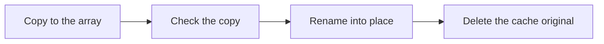

import Tabs from '@theme/Tabs';
import TabItem from '@theme/TabItem';

A cache disk is a fast disk, usually an SSD, that sits in front of the array. The mover is the job that later moves files from the cache to the array. You need to understand both to decide which shares use the cache, and because data on the cache is not protected by parity.

A cache disk gives you:

- **Fast writes.** New files land on the SSD first, at SSD speed.
- **Quiet array disks.** When app data lives on the cache, the constant small writes from databases and logs do not wake the array disks.
- **A per-share choice.** Each share decides how it uses the cache.

## The cache has two different jobs

The cache serves two purposes, and a share uses one of them:

1. **Write cache.** New files land on the cache, and the mover relocates them to the array later.
2. **Permanent home.** App data and databases live on the cache and are never moved.

Mixing these up is a common source of trouble, for example an app's database that gets moved to the array and then runs slowly. So Hoserva makes it an explicit setting on each share, the **Cache mode**:

| Cache mode | What happens | Typical use |
|---|---|---|
| **Cache then move** | New files land on the cache and the mover moves them to the array later. | Media you add, downloads |
| **Cache only** | Files stay on the cache and never touch the array. | App data, databases |
| **Array only** | Files are written straight to the array and skip the cache. | Bulk writes larger than the cache |

New shares use **Cache then move**.

:::danger[Cache-only data has no parity]
**A cache disk is not part of parity.** Files in a **Cache only** share are not protected against a disk failure, and neither are the files on the cache that the mover has not moved yet. If the cache disk fails, that data is lost. Back up what is on the cache. See [Parity is not backup](../concepts/parity-is-not-backup.md) for what Hoserva backs up for you.
:::

## When does the mover run?

The mover moves files from shares set to **Cache then move**. It leaves **Cache only** and **Array only** shares alone. It starts in three ways:

- **Every night.** It is the first step of the nightly maintenance chain, at 02:00 by default. The parity sync runs after it, so files the mover moved are covered by that night's sync.
- **When the cache is full.** It also starts when the cache disk reaches 70% full.
- **When you ask.** You can run it yourself at any time.

The mover skips a file that an app or a network client has open, and a file that changed in the last 5 minutes. It tries those files again on its next run.

## How does the mover move a file safely?

The mover never moves a file and hopes for the best. It copies the file, checks the copy, and removes the original only after that.



The mover writes through the share's own array mount, so the share's create policy chooses the disk, exactly as for a direct write. It keeps the owner, permissions, extended attributes and timestamps. If the power fails halfway, you are left with a duplicate and never with a gap: the original stays on the cache until the copy is verified.

## What if I change a share's cache mode?

Changing the mode changes where new files go. It does not move the files already there. When you change it, Hoserva asks whether to **Change mode only** or **Change mode and relocate**. A relocation is a one-off job that moves the whole share to match the new mode.

- **To the array:** the job works like a mover run limited to that share.
- **To the cache:** the job copies the files, checks them, syncs parity, and only then deletes the array copies.

A relocation is refused while an app that uses the share is running, because moving a live database is as unsafe as moving an open file. Stop those apps first.

## Where do I see and control it?

<Tabs groupId="interface">
  <TabItem value="web" label="Web UI" default>
    Open **Storage → Cache & mover**. The page shows the **Cache disk** and how full it is, the **Cache mode** of each share under **Per-share cache modes**, and the **Last mover run**.

    - Select **Run mover** to start the mover now. Select **View job** to follow it.
    - Change a share's mode in the **Per-share cache modes** table. The mover's schedule is in **Settings → Schedules**.
  </TabItem>
  <TabItem value="cli" label="CLI">
    ```bash
    hoserva mover run
    ```

    `hoserva jobs` lists the job and its progress.

    ```bash
    hoserva share relocate media --to cache
    ```

    `hoserva share relocate NAME --to array` moves a share's files to the array. `hoserva share create NAME --cache-mode cache-only` creates a share with a given mode. The choices are `cache-then-move`, `cache-only` and `array-only`.
  </TabItem>
</Tabs>

## Next steps

- [How pooling works](../concepts/how-pooling-works.md)
- [How parity works](../concepts/how-parity-works.mdx)
- [Parity is not backup](../concepts/parity-is-not-backup.md)
