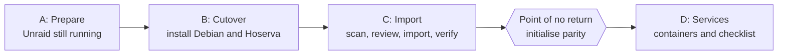

import TrademarkNotice from '@site/src/components/TrademarkNotice';

Hoserva can take over an existing Unraid array without copying your data. It reads Unraid's configuration, adopts the data disks as they are, and recreates your shares, accounts and containers on Debian. This page tells you what that covers, what it does not, and what it costs, so you can decide whether and when to do it.

<TrademarkNotice />

## What migrates

| What | How it arrives |
|---|---|
| Data disks | Adopted in place, with no copying and no formatting. Each disk keeps its own filesystem (XFS, ext4 or single-device btrfs) and is mounted read-only until you choose to go on. See [btrfs and ext4 data disks](./special-cases/btrfs-and-ext4-data-disks.mdx). |
| Shares | Created with the same names. Unraid's allocation method becomes a Hoserva create policy, and its cache setting becomes a cache mode. High-water has no exact equivalent and becomes the policy that writes to the disk with the most free space. |
| User accounts | Created from the Flash Backup without passwords. You set a new password for each one. |
| Docker templates | Converted to Compose stacks that you review and start one at a time. Paths under `/mnt/user` and `/mnt/cache` need no rewriting. |
| Compose Manager projects | Offered with their own `compose.yaml`, which is shown as it is and not converted. |
| User Scripts | Listed by name and schedule, so you know what existed. Hoserva never runs or translates them. |

Hoserva reads Unraid's configuration from a Flash Backup zip, which the [prepare script](./before-you-start.mdx) produces, or from the Unraid USB stick attached read-only. Unraid 6.12.x and 7.x are supported. Any other version is refused unless you override that on the command line. See [Unraid 7](./special-cases/unraid-7.mdx).

## What does not migrate

- **Passwords.** Unraid's password hashes are never read. Every SMB client has to reconnect with a new password.
- **Docker's own storage.** Images are pulled again when the containers are recreated. State that a container kept inside itself, rather than in a mapped folder, does not come back. The prepare script lists that state per container, while Unraid is still running.
- **Containers with no template.** A container created by hand, or one whose template was never saved, is listed by name and recreated from its settings or run command.
- **Custom configuration.** Plugins, custom Samba lines and custom `go` lines are reported and not imported.
- **Virtual machines.** VMs are not migrated by this flow yet. Their disk image files are ordinary files on the adopted disks and are carried along with the data.
- **Disks Hoserva cannot adopt.** Encrypted disks, ZFS disks and members of a multi-device btrfs filesystem are refused by name. The scan tells you which and why. See [Unsupported arrays](./special-cases/unsupported-arrays.mdx) for the reasons and for how to move the data onto disks Hoserva can adopt.

## What it costs

- **Hours of downtime.** The array is offline from the moment you stop it in Unraid until Hoserva is installed, the disks are adopted and verified, and the containers are started again. The checks read every file's details, so a large array takes a long time.
- **A full parity build.** Unraid's parity disk, or both of them with dual parity, is erased and rewritten as Hoserva parity. The scan estimates the first sync at an assumed 400 MB/s, which is about 17 hours for 24 TB of data. Treat that as a planning figure.
- **The unprotected window.** From the moment you stop the Unraid array until the first Hoserva parity sync has finished, the array has no redundancy at all. A disk that fails in that window takes its data with it.
- **A point of no return.** Everything before the step that formats the former parity disk can be undone. After it, going back means restoring from a backup. See [Rollback](./rollback.mdx).

## Does your server have a special case?

Most of the migration is the same for every server. These pages cover what differs:

- [Dual parity](./special-cases/dual-parity.mdx): two parity disks, both erased and rebuilt.
- [btrfs and ext4 data disks](./special-cases/btrfs-and-ext4-data-disks.mdx): the checks that can refuse one.
- [Named pools](./special-cases/named-pools.mdx): which pool becomes the cache, and flagged container paths.
- [No cache disk](./special-cases/no-cache-disk.mdx): the steps that do not apply.
- [Unraid 7](./special-cases/unraid-7.mdx): supported versions, the override and internal boot.
- [Unsupported arrays](./special-cases/unsupported-arrays.mdx): encrypted, ZFS and multi-device btrfs disks.

## How the migration is organised

The diagram shows the four phases. Unraid keeps running through the first one, and nothing is written to a data disk until the point of no return.

- [Before you start](./before-you-start.mdx) is the printable checklist for phase A.
- [The migration](./the-migration.mdx) walks through phases B to D.
- [After the migration](./after-the-migration.mdx) covers the closing checklist and the restore drill.

## Next steps

- [Before you start](./before-you-start.mdx)
- [Rollback](./rollback.mdx)
- [Troubleshooting](./troubleshooting.mdx)
